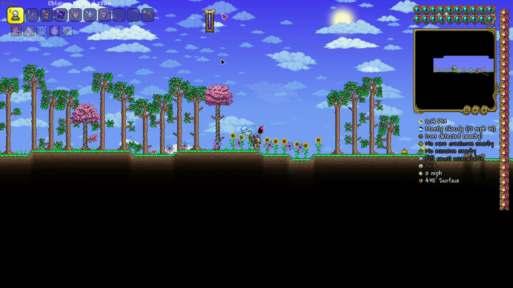
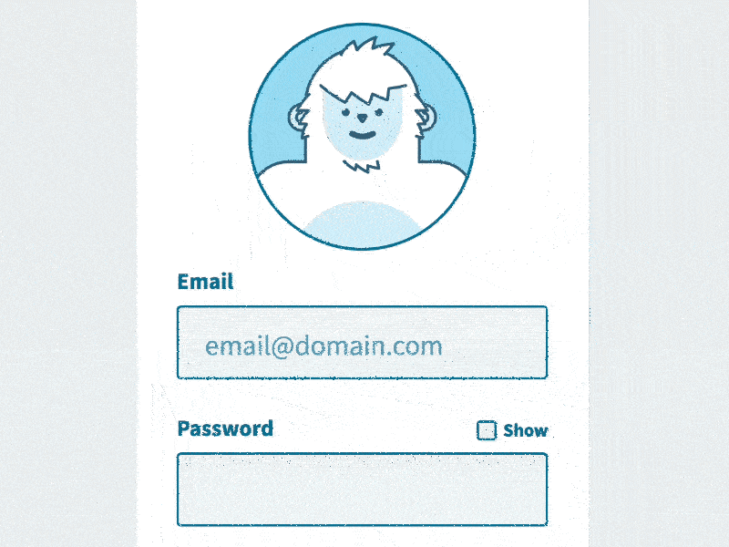
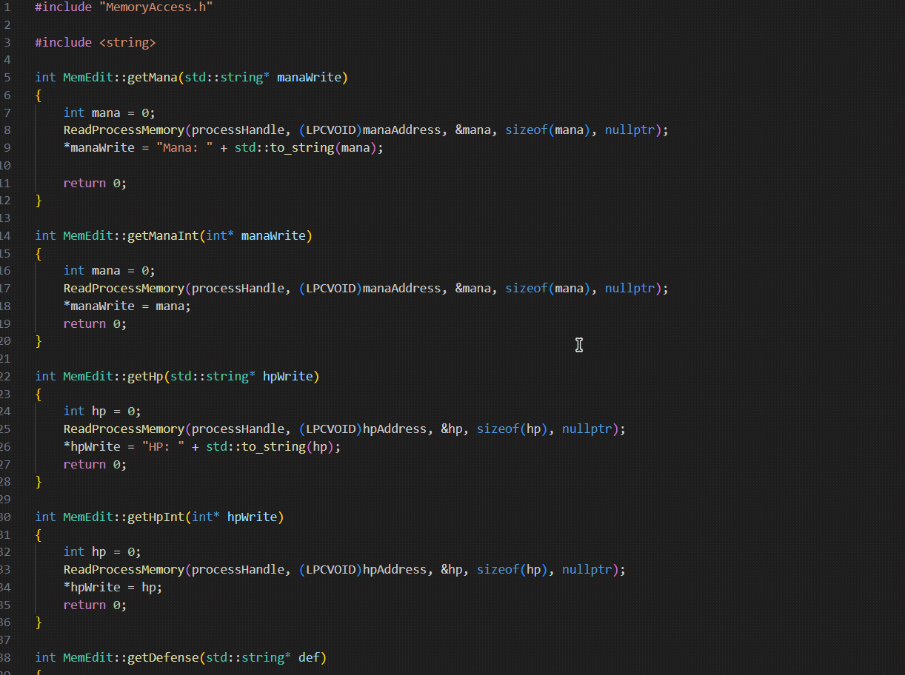
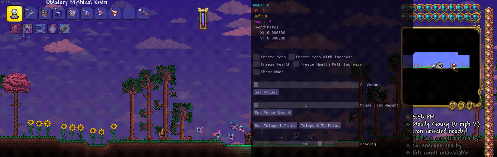

===================
TMenu Game Cheat
===================

.. image:: https://img.shields.io/badge/Version-1.0-blue
   :alt: Version 1.0
.. image:: https://img.shields.io/badge/License-Private-red
   :alt: License
.. image:: https://img.shields.io/badge/Platform-Windows-green
   :alt: Platform

|

**TMenu** is a powerful game memory manipulation tool built with ImGui and DirectX9, allowing you to enhance your gaming experience through various memory modifications.
|

.. contents:: Table of Contents
   :depth: 2
   :local:
   :backlinks: none

|

------------
Key Features
------------

.. image:: assets/features.gif
   :alt: Features Demo
   :align: center
   :width: 600px

|

✅ **Memory Manipulation**
   - Modify health and mana values
   - Freeze values at specific points
   - Allow values to only increase (never decrease)

✅ **Player Modifications**
   - Ghost mode (walk through walls/objects)
   - Teleportation system with position saving
   - Defense and life regeneration adjustment

✅ **Inventory Manipulation**
   - Set item amounts in inventory
   - Modify selected item properties

✅ **Authentication System**
   - Secure login with KeyAuth integration
   - User management with session tracking

✅ **User Experience**
   - Fully customizable overlay opacity
   - Intuitive GUI with color-coded values
   - Keyboard shortcuts for quick toggling

------------
Installation
------------

Prerequisites
============

- Windows OS
- Administrator privileges
- Target game must be running
- Microsoft Visual Studio 2019 or newer
- DirectX SDK
- Windows SDK 10.0 or newer
- C++ development tools

Setup
=====

1. Download the latest release from the releases page
2. Extract all files to a folder of your choice
3. Run ``MenuProtoOne.exe`` as administrator
4. Enter your login credentials when prompted

.. code-block:: bash

   # Alternative method (for developers)
   # Build from source using Visual Studio
   gh repo clone RS-Dev06/THeck
   cd THeck
   # Open MenuProtoOne.sln in Visual Studio and build

-----------------
Build From Source
-----------------

Development Environment Setup
============================

1. **Install Required Software:**

   - Visual Studio 2019 or newer with C++ desktop development workload
   - DirectX SDK (June 2010 or newer)
   - Windows 10 SDK

2. **Clone the Repository:**

   .. code-block:: bash

      gh repo clone RS-Dev06/THeck
      cd THeck

Building the Project
===================

**Using Visual Studio IDE:**

1. Open ``MenuProtoOne.sln`` in Visual Studio
2. Select your desired configuration:
   - ``Debug`` - For development with debugging symbols
   - ``Release`` - For optimized performance build
3. Select ``x64`` as the target platform
4. Build the solution by pressing ``F7`` or selecting ``Build > Build Solution``
5. The output executable will be created in either:
   - ``x64/Debug/`` for debug builds
   - ``x64/Release/`` for release builds

**Using Command Line:**

.. code-block:: bash

   # Navigate to project directory
   cd path\to\THeck
   
   # For Debug build
   msbuild MenuProtoOne.sln /p:Configuration=Debug /p:Platform=x64
   
   # For Release build
   msbuild MenuProtoOne.sln /p:Configuration=Release /p:Platform=x64

Dependencies
===========

The project has the following dependencies that are included in the repository:

- **Dear ImGui** - Included in ``ImGui/`` directory
- **libcurl** - For network communication, static library in ``Cheat/libcurl.lib``
- **KeyAuth** - Authentication system in ``Cheat/auth.hpp`` and ``Cheat/library_x64.lib``

Common Build Issues
==================

1. **DirectX SDK Missing:**
   
   If you encounter errors about missing DirectX headers or libraries:

   .. code-block:: text

      Error: Cannot open include file: 'd3d9.h': No such file or directory

   Ensure the DirectX SDK is properly installed and the paths are configured in Visual Studio:
   - Go to ``Project > Properties > VC++ Directories``
   - Add the DirectX SDK include and library paths

2. **Library Not Found:**

   .. code-block:: text

      Error: Cannot find library 'libcurl.lib' or 'library_x64.lib'

   The project is configured to look for these libraries in specific paths. Verify that:
   - The libraries are present in the ``Cheat/`` directory
   - The project properties correctly reference these paths

3. **Windows SDK Version:**

   If you encounter Windows SDK version mismatches:
   - Go to ``Project > Properties > General``
   - Update the Windows SDK Version to match your installed version

Customizing the Build
====================

To modify the build configuration:

1. **Change Target Game:**
   
   - Edit memory addresses and offsets in ``Cheat/MemoryAccess.cpp``
   - Update process name detection in ``MemEdit::MemEdit()`` constructor

2. **Disable Features:**
   
   - In ``Cheat/gui.cpp``, modify the ``Render`` function to remove unwanted features
   - Comment out corresponding sections in ``Cheat/MemoryAccess.cpp``

3. **Change UI Appearance:**
   
   - In ``gui.cpp``, modify the ``CreateImGui`` function
   - Adjust color schemes with ``ImGui::StyleColorsClassic()`` or other style functions
   - Modify window dimensions in ``gui.h`` by changing the ``WIDTH`` and ``HEIGHT`` constants

-----
Usage
-----

Basic Controls
=============

- **INSERT** - Toggle overlay visibility
- **END** - Exit application completely
- **HOME** - Reset all modifications to default values

|

Authentication
=============

|

1. Launch the application
2. Enter your username and password
3. Click "Login"
4. Upon successful authentication, the cheat menu will appear

Memory Manipulation
==================

|

**Health Management:**

- **Freeze Health**: Maintains health at the current value
  - Perfect for boss fights or difficult areas
  - Prevents any damage from affecting your character
  - Automatically reapplies the value whenever the game attempts to change it

- **Freeze Health With Increase**: Allows health to only increase, never decrease
  - Lets you collect health power-ups and healing items
  - Blocks all damage effects
  - Maintains maximum health during encounters

**Mana Management:**

- **Freeze Mana**: Maintains mana at the current value
  - Cast unlimited spells without depleting resources
  - Perfect for magic-heavy gameplay
  - Values are preserved between areas and loading screens

- **Freeze Mana With Increase**: Allows mana to only increase, never decrease
  - Collect mana boosts and power-ups
  - Cast spells without worrying about resource management
  - Automatically resets to highest achieved value if decreased

Player Modifications
===================

|

**Ghost Mode:**

1. Check the "Ghost Mode" box to enable walking through objects
   - Pass through walls, barriers, and obstacles
   - Access locked or restricted areas
   - Avoid environmental damage and traps
   - Explore out-of-bounds areas

2. Uncheck to return to normal collision detection

**Teleportation System:**

.. image:: assets/teleport.gif
   :alt: Teleportation System Demo
   :align: center
   :width: 600px

|

1. Navigate to the desired location in-game
2. Click "Set Teleport Point" to save coordinates
   - Multiple points can be saved during a session
   - Coordinates are displayed in real-time
   - Save points near difficult areas, bosses, or loot

3. Use "Teleport To Point" to instantly return to saved location
   - Bypass long travel distances
   - Escape dangerous situations
   - Return to farming spots quickly

**Defense & Regeneration:**

.. image:: assets/statView.gif
   :alt: Defense and Regeneration Demo
   :align: center
   :width: 600px

|

- View current defense values in real-time
- Monitor life regeneration rates
- Values update dynamically as gear changes or buffs apply
- Color-coded stats for easier reading:
  - Green: Optimal values
  - Yellow: Average values
  - Red: Critical values needing attention

Inventory Management
===================

.. image:: assets/inventory.gif
   :alt: Inventory Management Demo
   :align: center
   :width: 600px

|

**Slot Eleven Modification:**

1. Use the "SL Amount" slider to set desired quantity (1-100)
   - Perfect for consumables like potions or ammunition
   - Easily set exact quantities needed
   - Changes apply instantly in-game

2. Click "Set Amount" to apply changes
   - Modifications persist through area transitions
   - Stack sizes beyond normal game limitations
   - Circumvent inventory restrictions

**Mouse Item Manipulation:**

.. image:: assets/mouseInv.gif
   :alt: Mouse Item Manipulation Demo
   :align: center
   :width: 600px

|

1. Use the "Mouse Item Amount" slider to set desired quantity (1-100)
   - Modify currently held or selected items
   - Adjust quantities on-the-fly during gameplay
   - Perfect for active trading or crafting sessions

2. Click "Set Mouse Amount" to apply changes
   - Changes reflect immediately on cursor item
   - Useful for duplicating rare or valuable items
   - Great for crafting materials and stackable goods

Interface Customization
======================

.. image:: assets/customization.gif
   :alt: Interface Customization Demo
   :align: center
   :width: 600px

|

**Window Opacity:**

1. Use the "Opacity" slider to adjust transparency (50-255)
   - Lower values for minimal visual obstruction
   - Higher values for better readability
   - Find the perfect balance for your playstyle

2. Toggle visibility quickly with INSERT key
   - Instantly hide the menu when needed
   - Return to previous opacity settings when toggled back
   - Perfect for screenshots or recording gameplay

**Menu Positioning:**

- Click and drag the top bar to reposition the menu
- Position saved between sessions
- Place anywhere on screen for optimal visibility
- Automatically adjusts to screen resolution

---------------
Troubleshooting
---------------

Common Issues
============

**Application Won't Start:**

- Ensure you have administrator privileges
- Verify that the target game is running
- Check Windows Defender or antivirus is not blocking execution

**Authentication Failures:**

- Verify correct username and password
- Check internet connection
- Contact administrator if access should be granted

**Memory Modifications Not Working:**

- Game may have been updated, requiring pattern updates
- Anti-cheat systems may be interfering with memory access
- Restart both the game and TMenu

-------
Support
-------

If you encounter any issues or have questions, please contact us through one of these channels:

- **Discord**: Join our server at `discord.gg/tmenu <https://discord.gg/tmenu>`_
- **Email**: support@tmenu.com
- **GitHub Issues**: For bug reports and feature requests

-------
License
-------

TMenu is proprietary software. Unauthorized distribution, modification, or reverse engineering is strictly prohibited.

Copyright © 2023 TMenu Development Team. All rights reserved.

----------------
Acknowledgements
----------------

- **Dear ImGui** - Immediate mode GUI library
- **KeyAuth** - Authentication system
- **DirectX 9** - Graphics API

.. warning::

   This software is intended for educational purposes only. Use of this software may violate the terms of service of certain games. The developers are not responsible for any consequences resulting from the use of this software.